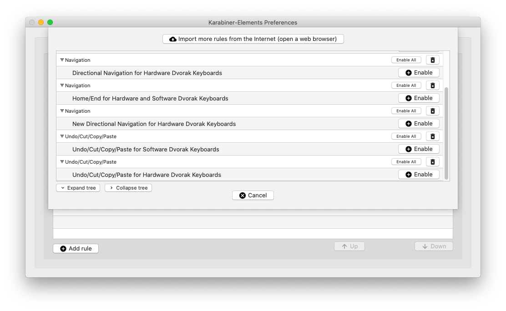

# Karabiner Elements Custom Complex Modifications
List of modifications for the standard Dvorak Keyboard Layout

## Get Started

1. Make sure you have the following:
* macOS Catalina ```10.15.3``` (anything lower is not tested)
* Karabiner-Elements ```11.6.0``` or higher

2. Find or create the following folder:
```
/Users/{username}/.config/karabiner/assets/complex_modifications
```

3. ```git clone``` into this folder or simply copy the json files into this folder

4. Start Karabiner-Elements and navigate to "Complex Modifications", click "Add Rule" and enable the rules you want to add


## Modifications for Software Dvorak Keyboards
Applicable to Macs using the "Dvorak Keyboard Layout" , the resulting key would remap into Dvorak on the system level.

* CMD+J to CMD+I
* CMD+K to CMD+PEROID(.) 
* CMD+Q to CMD+B
* CMD+; to CMD+SLASH(/)
* CMD+' to CMD+X

## Modifications for Hardware Dvorak Keyboards
Applicable to Macs using the standard QWERTY layout, but the keyboard remaps keystrokes to Dvorak on the hardware level
* CMD+J to CMD+C
* CMD+K to CMD+V 
* CMD+Q to CMD+X
* CMD+; to CMD+Z
* CMD+' to CMD+Q
